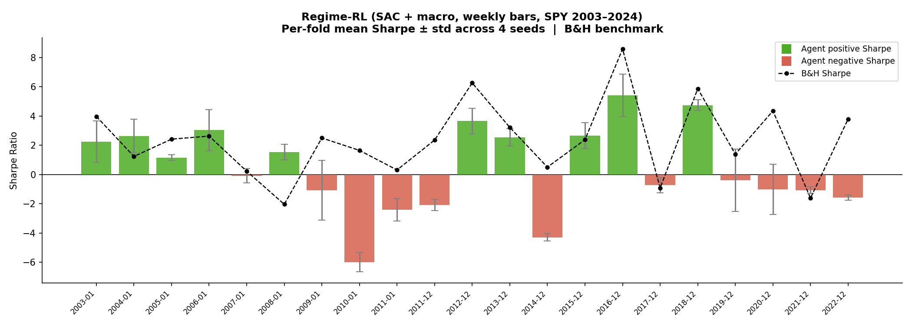
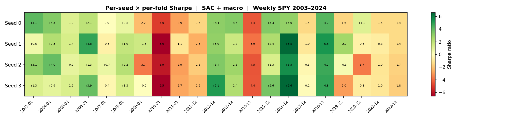

# regime-rl-trading

**Regime-aware Reinforcement Learning for Adaptive Trading Strategy Selection**

A modular Python framework that detects market regimes (Bull / Bear / Sideways / Volatile)
and uses RL agents to dynamically allocate capital across regime-optimised trading strategies.

---

## Architecture

```
Market Data → FeatureEngineer → RegimeDetector ──┐
                                                  ↓
                                        TradingEnv (Gymnasium)
                                                  ↓
                                         RL Agent (PPO / DQN / Meta)
                                                  ↓
                                Strategy Blending (4 strategies)
                                                  ↓
                                          Backtester → Metrics + Plots
```

### Regime Detection
| Detector | Description |
|---|---|
| `FeatureRegimeDetector` | Rule-based thresholds on volatility, trend & momentum (no training required) |
| `HMMRegimeDetector` | Gaussian HMM with automatic state → regime mapping via `hmmlearn` |

### Strategies
| Strategy | Regime Fit | Core Signal |
|---|---|---|
| `MomentumStrategy` | BULL | Short/long MA crossover + 10-day momentum |
| `MeanReversionStrategy` | SIDEWAYS | RSI + Bollinger Band extremes |
| `BreakoutStrategy` | VOLATILE | Bollinger Band breakout (upper/lower) |
| `TrendFollowingStrategy` | BEAR / VOLATILE | Long-MA trend filter; scales 0→0.5→1.0 with momentum confirmation |

### Agents
| Agent | Description |
|---|---|
| `SACAgent` | Stable-Baselines3 SAC — primary agent, soft continuous action blending |
| `PPOAgent` | Stable-Baselines3 PPO with `MlpPolicy` |
| `DQNAgent` | Stable-Baselines3 DQN with discrete strategy selection |
| `MetaAgent` | Ensemble of per-regime PPO agents; routes by detected regime |

---

## Project Structure

```
regime-rl-trading/
├── config/default.yaml          # All hyperparameters
├── train.py                     # Training entry-point
├── evaluate.py                  # Evaluation entry-point
├── notebooks/exploration.ipynb  # Interactive exploration
├── src/
│   ├── regime_detection/        # HMM & feature-based detectors
│   ├── strategies/              # 4 trading strategies
│   ├── environment/             # Gymnasium TradingEnv + features
│   ├── agents/                  # PPO, DQN, MetaAgent
│   └── evaluation/              # Backtester + Visualizer
└── tests/                       # pytest smoke tests
```

---

## Quick Start

### 1. Install dependencies

```bash
pip install -r requirements.txt
```

### 2. Train

```bash
python train.py --config config/default.yaml --ticker SPY
# Model saved to results/model/ppo_SPY.zip
```

### 3. Evaluate

```bash
python evaluate.py --config config/default.yaml --ticker SPY
# Prints metrics; saves plots to results/plots/
```

### 4. Walk-forward evaluation (locked-in config)

```bash
# Weekly SPY 2003–2024, SAC + macro features, 21 folds
python -m tests.test_walk_forward \
  --start 2000-01-01 --end 2024-04-01 --ticker SPY \
  --interval 1wk --train-size 156 --test-size 52 --step 52 --embargo 2 \
  --timesteps 50000 --agent sac --return-weight 0.0 --macro \
  --output results/wf_weekly_soft_macro.json
```

### 5. Explore interactively

```bash
jupyter notebook notebooks/exploration.ipynb
```

---

## Running Tests

```bash
pytest tests/ -v
```

Tests that require heavy dependencies (`hmmlearn`, `torch`, `stable-baselines3`) are
skipped automatically when those packages are not installed.

---

## Configuration

All settings live in `config/default.yaml`:

```yaml
agent:
  type: ppo          # ppo | dqn
  training_episodes: 1000

regime_detection:
  method: feature    # feature | hmm

data:
  tickers: [SPY]
  start_date: "2015-01-01"
  end_date:   "2023-12-31"
```

---

## Performance Metrics

The `Backtester` computes:
- Total & annualised return
- Sharpe ratio, Sortino ratio, Calmar ratio
- Maximum drawdown
- Win rate, Profit factor
- Buy-and-hold benchmark comparison

---

## Experimental Results

### Setup

| Parameter | Value |
|---|---|
| Ticker | SPY |
| Bar interval | Weekly (`1wk`) |
| Date range | 2000-01-01 → 2024-04-01 |
| Walk-forward folds | 21 (train=156wk, test=52wk, step=52wk, embargo=2wk) |
| Agent | SAC, 50 000 timesteps / fold |
| Reward | Differential Sharpe Ratio (`return_weight=0`) |
| Observation features | 10 price/vol features + 19 macro features (VIX, term spread, credit spread …) |
| Seeds evaluated | 0, 1, 2, 3 |

### Per-fold mean Sharpe ± std (4 seeds)



### Seed × fold Sharpe heat-map



### Aggregate (seeds 0–3)

| Metric | Value |
|---|---|
| Mean Sharpe (per-fold mean across seeds) | **+0.43** |
| Median Sharpe | +0.64 |
| Std Sharpe | 2.85 |
| Folds with positive Sharpe | 12 / 21 |

### Per-fold multi-seed results (all 21 folds × 4 seeds)

| Fold | Period | Seed 0 | Seed 1 | Seed 2 | Seed 3 | Mean | B&H |
|---|---|---|---|---|---|---|---|
| 0 | 2003-01 | +4.12 | +0.54 | +3.06 | +1.30 | +2.25 | +3.91 |
| 1 | 2004-01 | +3.29 | +2.34 | +3.99 | +0.91 | +2.63 | +1.11 |
| 2 | 2005-01 | +1.21 | +1.41 | +0.88 | +1.28 | +1.20 | +2.34 |
| 3 | 2006-01 | +2.12 | +4.82 | +1.29 | +3.88 | +3.03 | +2.53 |
| 4 | 2007-01 | −0.02 | −0.62 | +0.73 | −0.39 | −0.08 | +0.14 |
| 5 🔒 | **2008-01** | **+0.77** | **+1.88** | **+2.18** | **+1.32** | **+1.54** | **−2.03** |
| 6 | 2009-01 | +0.83 | +1.91 | +2.17 | +1.33 | +1.56 | +2.44 |
| 7 | 2010-01 | −2.22 | −6.61 | −3.73 | −6.46 | −4.76 | −2.26 |
| 8 | 2011-01 | −4.97 | −6.64 | −5.92 | −2.73 | −5.07 | +0.16 |
| 9 | 2011-12 | −2.90 | −1.12 | −1.77 | −2.28 | −2.02 | +0.29 |
| 10 | 2012-12 | +3.14 | +2.99 | +3.41 | +5.08 | +3.66 | +6.08 |
| 11 | 2013-12 | +3.29 | +1.68 | +2.79 | +2.42 | +2.55 | +3.24 |
| 12 | 2014-12 | −4.43 | −3.87 | −4.47 | −4.38 | −4.29 | +0.15 |
| 13 | 2015-12 | +3.26 | +2.40 | +1.26 | +3.59 | +2.63 | −0.13 |
| 14 | 2016-12 | +2.97 | +6.52 | +5.51 | +6.56 | +5.39 | +8.36 |
| 15 | 2017-12 | −1.48 | −0.98 | −0.33 | −0.14 | −0.73 | −0.80 |
| 16 | 2018-12 | +4.22 | +5.33 | +4.67 | +4.82 | +4.76 | +5.77 |
| 17 | 2020-01 | −1.55 | −0.64 | +2.68 | −2.98 | −0.62 | +0.32 |
| 18 | 2021-01 | +1.12 | +2.74 | +0.34 | −0.84 | +0.84 | −0.63 |
| 19 🔒 | **2022-01** | **−1.40** | **−0.76** | **−1.03** | **−1.02** | **−1.05** | **−1.60** |
| 20 | 2022-12 | −1.43 | −1.40 | −1.71 | −1.82 | −1.59 | +3.84 |

🔒 = robust fold: all 4 seeds beat B&H

### Key findings

- **Crisis protection is robust.** Fold 5 (GFC 2008) is the only fold where all 4 seeds beat B&H; mean Sharpe +1.54 vs B&H −2.03. The agent reliably learns to reduce exposure through a sustained crash. Fold 19 (2022 rate-shock) also has all 4 seeds beating B&H.
- **Macro features reduce recovery lag.** Without macro, the HMM over-labels post-crash recovery years (2009: 84% VOLATILE, 2020: 81% VOLATILE), causing the agent to miss the rally. VIX trend, credit spreads and term structure provide a "stress-easing" signal the HMM state alone cannot.
- **Bull markets underperform B&H.** In low-volatility trending markets the agent earns positive absolute Sharpe but trails buy-and-hold. The system is a drawdown-reduction overlay, not a bull-market outperformer.
- **Failure modes are seed-consistent.** Folds 7–9 (2010–2012) and fold 12 (2015) are negative across all seeds, suggesting the features genuinely cannot resolve those environments, not just bad luck.

---

## License

MIT – see [LICENSE](LICENSE).
